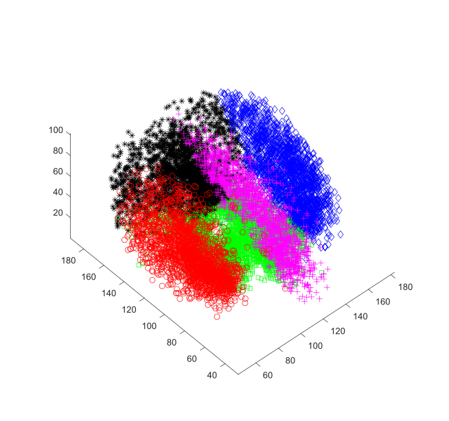
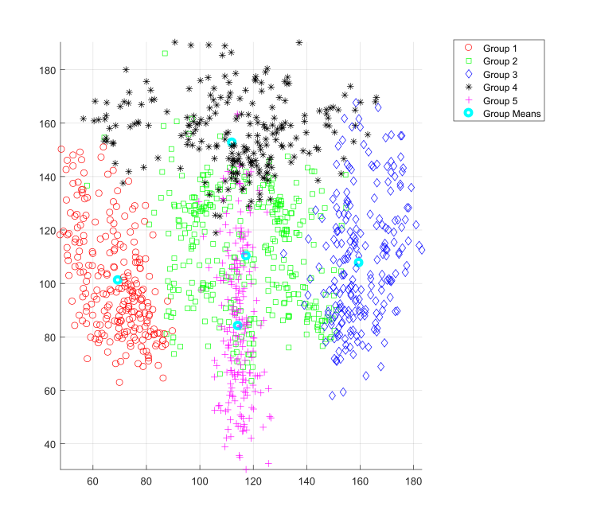

# Probabilistic Modeling Project 

To run the project clone the repository and run projectMain.m using MATLAB.
You will need to acquire the dataset.

# Description

A dataset of 97 hunman MRA images with the detected vasculature and the branching points were used to cluster the cerebrovasculature branching points into group to observed the distribution of cerebral vascular branching points over the population.

best describing configuration waws obsereved with 5 clusters as seen below, best capturing each region in the brain having distributions of the branchings.

  

  

